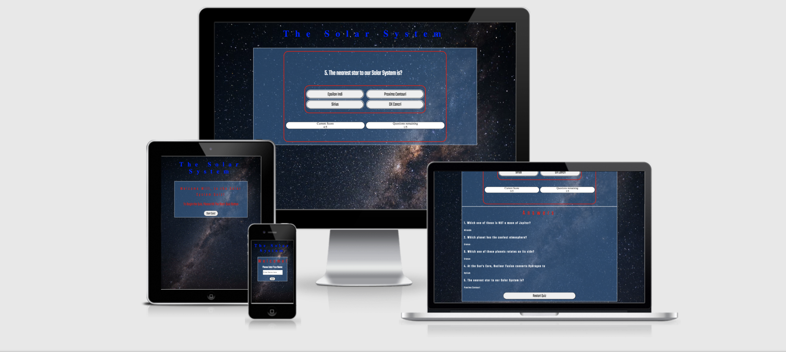
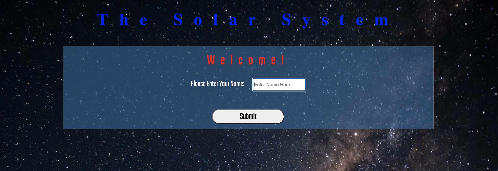
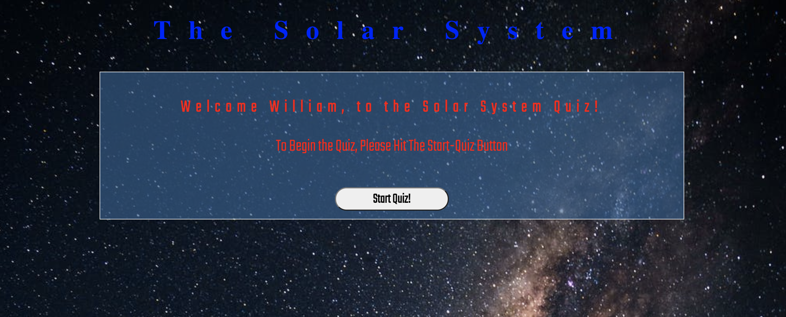
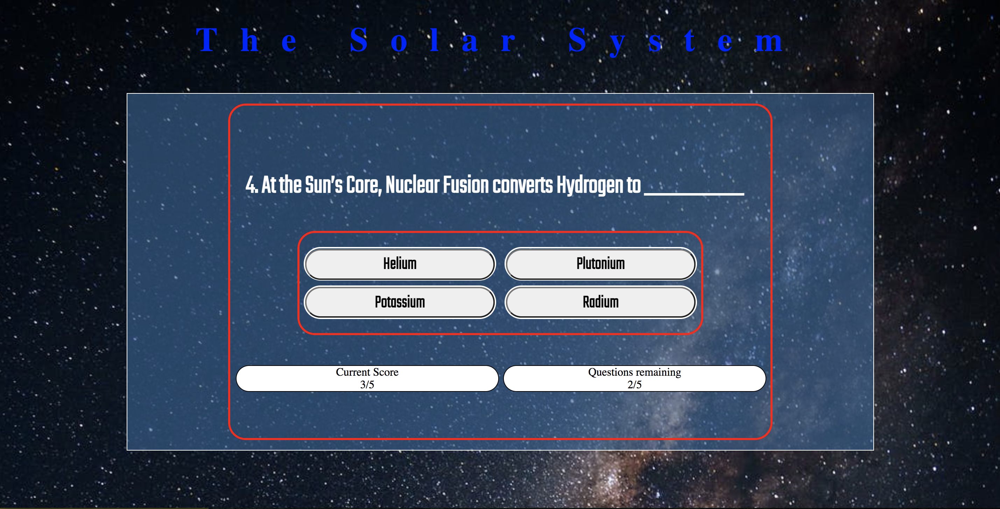
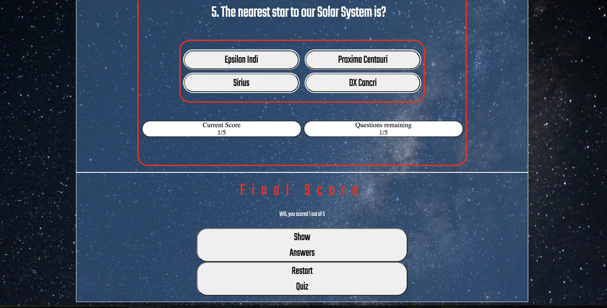
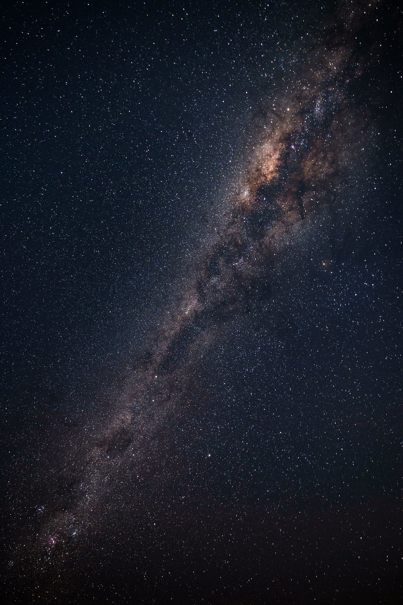
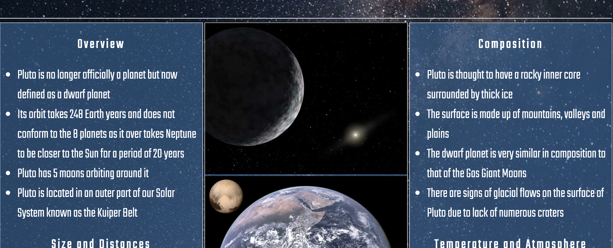
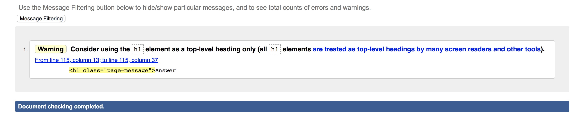
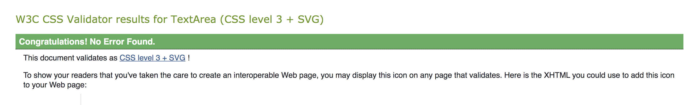
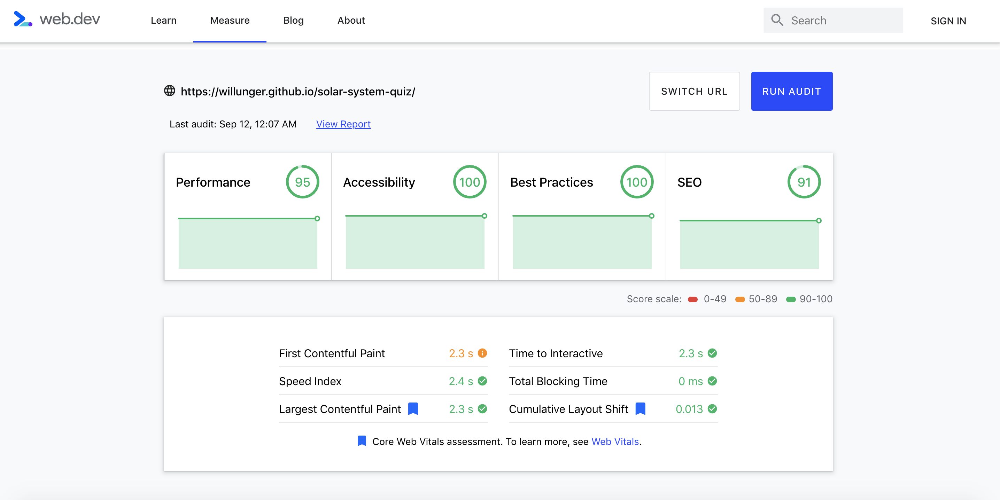

# The Solar System Quiz
The Solar System Quiz is a simple 5 question quiz that utilises HTML, CSS and of course Javascript for the sake of this project. The game itself is easy to navigate through as there are instructions and prompts all the way through. As shown by the image below, the project is also responsive to multiple devices using 'media-queries'.

Live Website - https://willunger.github.io/solar-system-quiz/

#Features

## Opening Section

* The opening section uses a simple username-input feature. This prompts the user to engage with the game straight off the bat.

* By virtue of entering your username, there will be a Welcome Message when you click submit.

## Quiz Section

* Once you hit 'Start Quiz!' the game begins.
* The Quiz itself is self-explanatory - Question + Options and you choose the one you think is correct.

* As opposed to the Options being stacked on top of eachother in 4 columns they are stacked 2X2 on any device where the screen is over 900px - Medium to Large Tablets, Laptops and Desktops.
* This aims to make the Quiz neat, simple and compact.

## Final Scores Section

* Once the last question has been answered, a "drop-down" appears with your final score and the options to view the answers or restart the quiz

## Answers Section

* Finally if you wish to find out the answers you can simply click the 'Show Answers' button to reveal them.

* Should you wish to repeat the quiz, you can click the 'Restart Quiz' Button.

# Theme and Design

* As you can see from the images above, there is a constant 'Night Sky' theme throughout the whole game.
* This was borrowed directly from my last project also based on the Solar System.
* The background used is that of the Milkyway - Courtesy of commons.wikimedia

* The transparant light blue Div that contains all the features of the game/quiz is also borrowed from my last project.
* background-color: rgba(51,102,153,.6);
    box-sizing: border-box;
    border: solid 1px #fff;

    This is the CSS used to achieve this result as you can see from the images above. Below is a screenshot from my other project - The-Solar-System

    

* As I was doing another project that involved the subject of the Solar System, I thought it would be appropriate to keep the imagery consistent.

* If your eye for fonts is particularly astute, you notice that I used the same 'Teko', san-serif; from google-fonts as imported into style.css

# Testing

* The HTML & CSS passed all the validators. The HTML showed a warning for a class attribute within a h1 that was used but this is of no concern as the project has not been affected in any negative way.

* Lighthouse Testing was also done - See image below

# Unfixed Bugs

* Some of the responsivenss is lacking particularly in the Options buttons. 
* The buttons are placed inside a div and the font can seem cramped when using lower px screens

# Deployment

The site was deployed to GitHub pages. The steps to deploy are as follows:

* In the GitHub repository, click on the Settings tab
* Scroll down to the pages section and click into it
* From the source section Drop-Down Menu, select the Main Branch
* A link is then generated and provided

# Credits

* The Fonts used can be sourced from https://fonts.google.com/
* The images and particular fonts used are mentioned throughout the README.md
* W3schools, Slack Community have been a huge help as I found Javascript very difficult

Of course, I must thank my mentor - Richard Wells - Again, always encouraging and helpful!